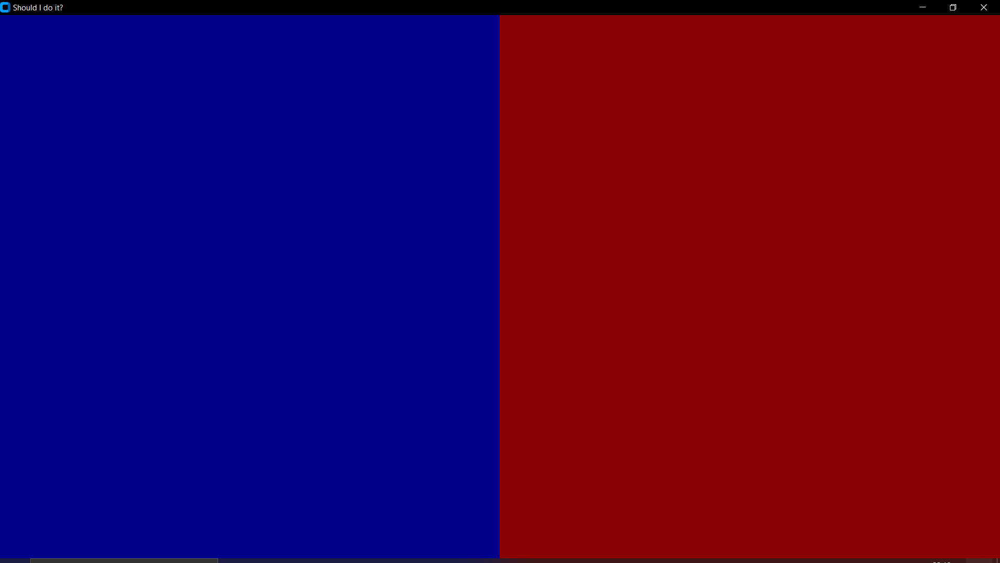
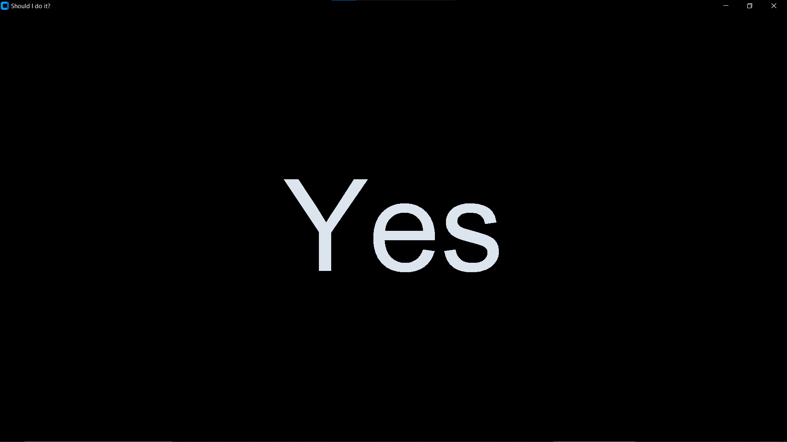

# Should I Do It?

This is a simple fun Python application using `customtkinter` that helps you decide whether to do something by displaying a random "Yes" or "No" answer. The application features a main window with two frames that change colors when clicked, and displays the answer with a click to restart.

## Features

- Randomly displays "Yes" or "No" as an answer.
- Frames change colors when clicked.


## Installation

1. Clone the repository:
    ```sh
    git clone https://github.com/Godyrex/RandomChoice.git
    cd should-i-do-it
    ```

2. Install the required dependencies:
    ```sh
    pip install customtkinter
    ```

## Usage

Run the application:
```sh
python main.py
```
## Screenshots

### Main Window


### Answer Display

